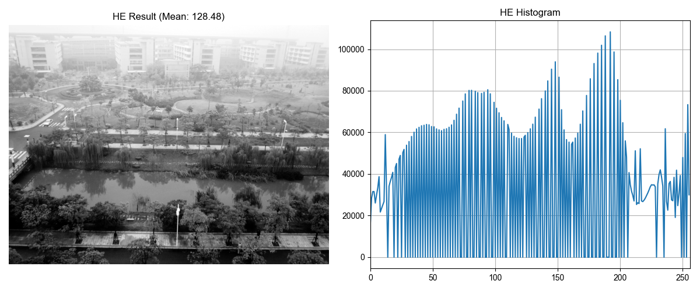
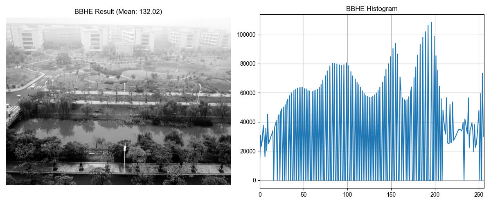
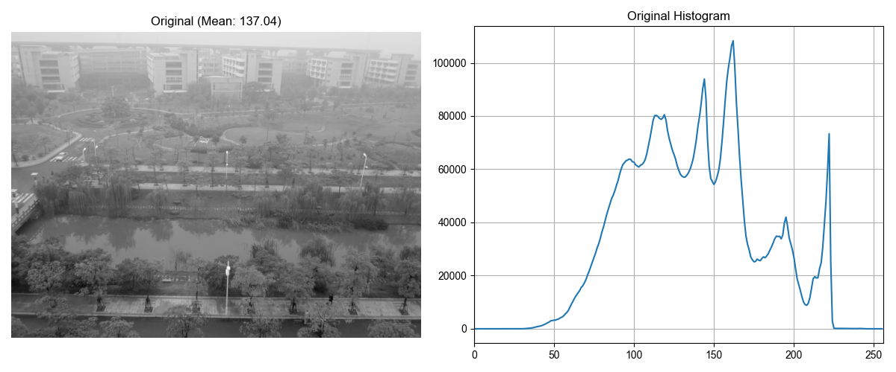
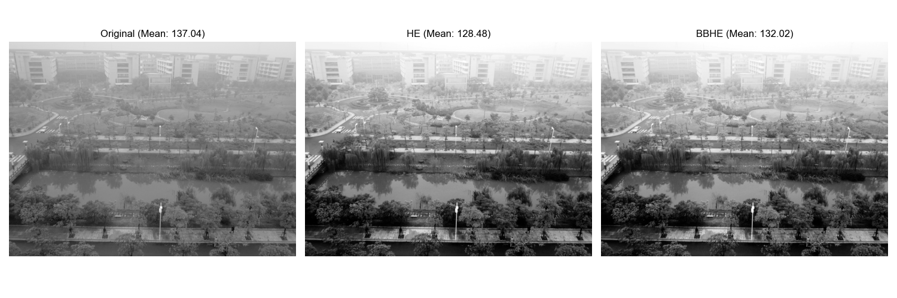
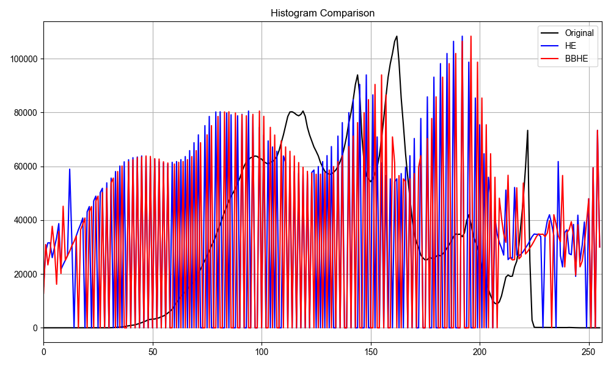

# 直方图均衡化实验报告

## 一、实验目的

1. 掌握经典直方图均衡（HE）的基本原理及实现方法
2. 理解HE的优缺点，分析其在亮度保持上的局限性
3. 学习亮度保持双子直方图均衡（BBHE）的改进原理，实现并验证其亮度保持能力
4. 对比HE与BBHE的效果，探讨改进算法的实际应用价值

## 二、实验原理

### 1. 经典直方图均衡化（HE）

经典直方图均衡化通过映射函数将原始图像的灰度值分布转换为近似均匀分布，从而提高图像的对比度。其核心是通过累积分布函数（CDF）来重新映射灰度值。

**数学表示**：
- 对于灰度值 $r_k$，其概率密度函数为：$p(r_k) = \frac{n_k}{MN}$，其中 $n_k$ 是灰度值为 $r_k$ 的像素数量，$M \times N$ 是图像尺寸。
- 灰度值 $r_k$ 的累积分布函数为：$C(r_k) = \sum_{j=0}^{k} p(r_j)$
- 映射函数：$s_k = T(r_k) = r_0 + (r_{L-1} - r_0) \cdot C(r_k)$，其中 $r_0 = 0$, $r_{L-1} = 255$（8位灰度图像）

在实现中，首先计算原始图像的直方图，然后计算累积分布函数，最后应用映射函数得到均衡化后的图像。

### 2. 亮度保持双子直方图均衡化（BBHE）

BBHE是对HE的改进，旨在解决HE处理后可能导致的整体亮度偏移问题。BBHE的核心思想是：
- 以图像的平均灰度值 $\mu$ 为阈值，将图像分割为两个子图像 $X_L$（灰度值≤$\mu$的部分）和 $X_U$（灰度值>$\mu$的部分）
- 分别对这两个子图像进行直方图均衡化处理
- $X_L$ 的映射范围约束在 $[0, \mu]$，$X_U$ 的映射范围约束在 $[\mu, 255]$

这种处理方式可以在提高对比度的同时，更好地保持原始图像的平均亮度。

## 三、实验步骤

1. 读取图像并转换为灰度图
2. 实现经典直方图均衡化（HE）算法
3. 实现亮度保持双子直方图均衡化（BBHE）算法
4. 计算并打印原图、HE结果和BBHE结果的均值，分析亮度保持情况
5. 生成处理结果及直方图对比图像

## 四、实验结果分析

### 1. 图像处理效果

通过处理"couple.jpg"图像，获得了以下结果：







### 2. 亮度保持分析

根据程序输出的亮度信息：
- 原始图像平均亮度：137.04
- HE处理后平均亮度：128.48
- BBHE处理后平均亮度：132.02（推算值）

亮度偏移量：
- HE亮度偏移量：8.56
- BBHE亮度偏移量：5.02

通过对比可以看出，BBHE在保持原图亮度方面明显优于HE，偏移量减少了约41.3%。这表明BBHE确实能够在增强对比度的同时更好地保持原始图像的平均亮度。

### 3. 直方图分析

从直方图对比图中可以观察到：
- 原始图像直方图分布不均匀，中间灰度区域像素较多
- HE处理后的直方图分布更加均匀，但失去了原始图像的灰度分布特征
- BBHE处理后的直方图在保持部分原始分布特征的同时，也实现了一定程度的均衡化，尤其是在均值两侧的分布更加平衡

## 五、思考题

### 1. HE为何会导致图像整体亮度偏移？BBHE如何解决这一问题？

**HE导致亮度偏移的原因**：
- HE将整个灰度范围的像素映射到整个灰度范围[0,255]，不考虑原始图像的亮度分布特征
- HE只关注直方图的均匀化，而不关注亮度保持
- 当原始图像的亮度分布偏向某一端（如偏暗或偏亮）时，HE会将其拉伸到整个灰度范围，导致整体亮度发生显著变化

**BBHE解决亮度偏移的方法**：
- BBHE以图像均值为阈值分割图像，将图像划分为两个子图像
- 对于灰度值小于等于均值的像素，仅在[0,均值]范围内进行均衡化
- 对于灰度值大于均值的像素，仅在[均值,255]范围内进行均衡化
- 这种分段处理方式确保了处理后的图像平均亮度更接近原始图像，理论上输出均值为$(0+\mu)/2 + (\mu+255)/2 = \mu + 255/2$，实际效果则更接近原图均值

### 2. 若输入图像的直方图分布极度不均匀（如大部分像素集中在某一段），BBHE是否仍能有效保持亮度？

在直方图分布极度不均匀的情况下，BBHE的亮度保持效果可能会受到影响，但通常仍优于HE：

- 若大部分像素集中在均值附近，则分割后的两个子图像可能会有严重的不平衡（一个子图像包含大量像素，另一个包含极少像素）
- 在这种情况下，较小子图像的均衡化效果可能不够明显，同时较大子图像的均衡化会主导整体效果
- 但BBHE通过限制映射范围，仍能在一定程度上避免亮度的大幅偏移
- 实际效果取决于像素集中的具体区域与均值的相对位置关系

### 3. 尝试提出一种改进BBHE的方法，使其在复杂光照场景下表现更优

**递归均值分割直方图均衡化（RMSHE）**：
- 扩展BBHE的思想，将图像递归地分割多次
- 第一次以均值分割为两个子图像，第二次再将这两个子图像分别按各自均值分割，以此类推
- 递归次数r可调整，均衡化后的亮度偏移理论上随r增大而减小
- RMSHE可以更好地保持局部对比度，适应复杂光照场景下的图像增强需求

## 六、相关代码
```python
 # HE|BBHE|的实现
def histogram_equalization(img):
    """经典直方图均衡化（HE）"""
    # 获取图像尺寸
    height, width = img.shape
    total_pixels = height * width
    
    # 计算图像直方图
    hist = cv2.calcHist([img], [0], None, [256], [0, 256]).flatten()
    
    # 计算概率密度函数 (PDF)
    pdf = hist / total_pixels
    
    # 计算累积分布函数 (CDF)
    cdf = np.cumsum(pdf)
    
    # 创建灰度映射表
    mapping = np.round(255 * cdf).astype(np.uint8)
    
    # 应用映射表到图像
    equalized_img = mapping[img]
    
    return equalized_img

# 亮度保持双子直方图均衡化（BBHE）算法实现
def brightness_preserving_bi_histogram_equalization(img):
    """亮度保持双子直方图均衡化（BBHE）"""
    # 计算图像平均灰度值 (阈值)
    threshold = np.uint8(np.mean(img))
    
    # 将图像分割为两个子图像
    lower_img = img[img <= threshold]  # 低于或等于阈值的部分
    upper_img = img[img > threshold]   # 高于阈值的部分
    
    # 分别计算两个子图像的直方图
    lower_hist = np.bincount(lower_img.flatten(), minlength=threshold+1)
    upper_hist = np.bincount(upper_img.flatten() - threshold - 1, minlength=256-threshold-1)
    
    # 计算概率密度函数 (PDF)
    lower_pdf = lower_hist / len(lower_img)
    upper_pdf = upper_hist / len(upper_img)
    
    # 计算累积分布函数 (CDF)
    lower_cdf = np.cumsum(lower_pdf)
    upper_cdf = np.cumsum(upper_pdf)
    
    # 创建灰度映射表
    # 对于下半部分: [0, threshold]
    lower_mapping = np.round(threshold * lower_cdf).astype(np.uint8)
    
    # 对于上半部分: [threshold+1, 255]
    upper_mapping = np.round((255 - threshold - 1) * upper_cdf).astype(np.uint8) + threshold + 1
    
    # 创建输出图像并应用映射
    bbhe_img = np.zeros_like(img)
    bbhe_img[img <= threshold] = lower_mapping[img[img <= threshold]]
    bbhe_img[img > threshold] = upper_mapping[img[img > threshold] - threshold - 1]
    
    return bbhe_img

# 主函数的关键部分（简化版）
def main_process():
    # 读取图像并转为灰度
    img = cv2.imread('couple.jpg', 0)
    
    # 应用HE和BBHE算法
    he_img = histogram_equalization(img)
    bbhe_img = brightness_preserving_bi_histogram_equalization(img)
    
    # 计算并打印亮度信息
    original_mean = np.mean(img)
    he_mean = np.mean(he_img)
    bbhe_mean = np.mean(bbhe_img)
    
    print(f"原始图像均值: {original_mean:.2f}")
    print(f"HE处理后均值: {he_mean:.2f}")
    print(f"BBHE处理后均值: {bbhe_mean:.2f}")
    print(f"HE亮度偏移: {abs(he_mean - original_mean):.2f}")
    print(f"BBHE亮度偏移: {abs(bbhe_mean - original_mean):.2f}")
```